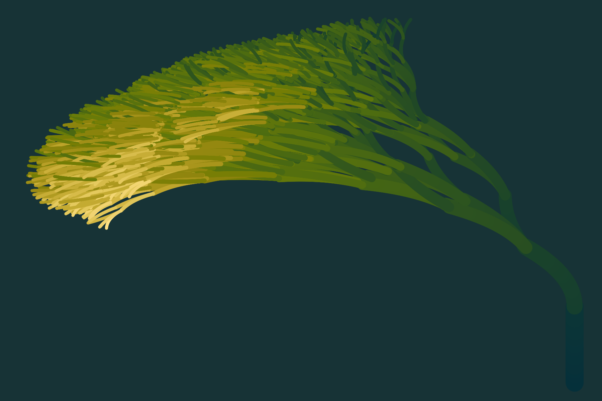

```{r, include = FALSE}
knitr::opts_chunk$set(
  echo = FALSE
)
```

# 30 Day Chart Challenge

## Day 1: Part-to-whole

```{r, fig.alt = "A waffle chart of squares with 10 rows and 10 columns showing the breakdown of tracked time worked in March 2021. The categories are: Admin 2% Prospective work 4% Community 7% Personal projects 38% Client work 49%. The chart has an annotation saying that 1 square represents 1% of tracked time. The colours in the chart are dark teal light teal yellow orange and red. The data is here https://github.com/sharlagelfand/30DayChartChallenge/blob/main/01-part-to-whole/march_time_tracking.csv"}
knitr::include_graphics("01-part-to-whole/part-to-whole.png")
```

## Day 2: Pictogram

```{r, fig.alt = "A pictogram showing the contents of my music collection using icons to represent each type of item. there are 36 twelve inch records 42 seven inch records and 77 casette tapes. the image has a light purple background with a seventies style font in a darker purple. The data is here https://raw.githubusercontent.com/sharlagelfand/30DayChartChallenge/main/02-pictogram/music_collection.csv"}

```

## Day 5: Slope

```{r, fig.alt = "A line chart showing the cumulative number of downloads of the opendatatoronto package from CRAN/ The data starts on october 28 2019 with 4 downloads and ends on April 5 2021 with 13572 downloads. in the middle there is a large jump labelled 'the u of t' effect. the line in the chart is a dark yellow and made in R but the annotations and labels are all hand drawn in black. the background of the chart is white with black dotted grid lines. The data is here: https://github.com/sharlagelfand/30DayChartChallenge/blob/main/05-slope/data.csv"}

```

## Day 6: Experimental

```{r, fig.alt = "A randomly generated tree with thousands of branches. The trunk of the tree starts on the right and bends heavily to the left. it is coloured in various shades of teal to light green to light yellow with a dark teal background"}

```

## Day 7: Physical

```{r, fig.alt = "A scene of randomly generated trees in various shades of teal and green formed around a light desaturated green sphere. the background is a blurry scene with grass and trees in the background and the sun setting"}
knitr::include_graphics("07-physical/physical.png")
```

## Day 8: Animals

```{r, fig.alt = 'A data visualization depicting the top 3 most popular dog names in Toronto from 2012 to 2020. The top 3 dogs are on a raised podium similar to ones used in sports, with the first place in the middle on the highest podium second place to the left on a slightly shorter one and third place on the right on an even shorter one. there is one set of podiums for each year, laid out in 2 rows. the dogs are depicted by different icons each dogs icon is different and coloured differently, in orange, red, purple, blue, and brown. the first panel is a legend that depicts this, the caption reads "Charlie has consistently been the most popular name since 2012. Max held strong in second place until 2016, when it was overtaken by Bella. Luna suddenly took over 2nd place in 2020, despite never appearing in the top 3 before!" Data: https://raw.githubusercontent.com/sharlagelfand/30DayChartChallenge/main/08-animals/top_3_names_by_year.csv'}

```

## Day 9: Statistics

```{r, fig.alt = 'An image of two statistical distributions. The one on the left is a normal distribution coloured in orange with a serious face. the one on the right is a bimodal distribution coloured in blue with a silly face. the orange one is saying to the other one "you\'re not normal"'}

```

## Day 13: Correlation

```{r, fig.alt = 'A hand drawn line chart titled "#30DayChartChallenge be like" on the x axis is "number of failed viz attempts" on the y axis is "motivation to finish and actually post something". the correlation is negative'}

```
